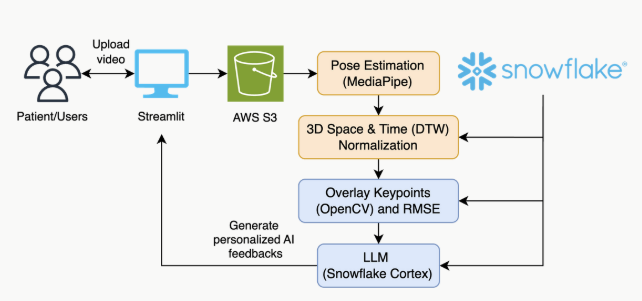

# PhysioPro
Enhancing Mobility with Generative AI-Driven Motion Correction

PhysioPro is a physiotherapy assistance tool that aligns patient movement data with standard physiotherapy exercises, generates corrected movement visualizations using AI, and overlays them onto patient videos for feedback and guidance.

## Overview

The project consists of three main scripts:
1. **Spatial and Temporal Alignment**: Fetches keypoint data from Snowflake, aligns patient movements to a reference video using Procrustes analysis and Dynamic Time Warping (DTW), and interpolates the data in 3D space and time.
2. **AI-Powered Recommendations**: Generates personalized feedback and exercise recommendations. It also creates overlay animations showing patient movement vs. correct movement.
3. **Web Interface**: User-friendly Streamlit interface for data input and result visualization.

## System Architecture



The system consists of two main components:
1. **Motion Analysis Engine (Python backend)**: 
Video processing and 3D keypoint extraction
Spatial and temporal alignment
Error calculation and metrics
Animation generation.
2. **Web Interface (Streamlit frontend)**: 
User information collection
Video upload
Results visualization
AI feedback display.

## Prerequisites

- **Python**: 3.10 or later
- **GPU (Optional)**: NVIDIA GPU with CUDA support for faster image generation
- **Snowflake Account**: For accessing keypoint data
- **Video Files**: Patient videos in `.mp4` format
- **Hugging Face Account**: For downloading Stable Diffusion models (optional token required)

### 1. Clone the Repository
```bash
git clone <https://github.com/Samhita-kolluri/PhysioPro>
cd PhysioPro
```
### 2. Install Dependencies
```bash
pip install -r requirements.txt
```
### 3. Configure Environment Variables
```bash
SNOWFLAKE_USERNAME=your_username
SNOWFLAKE_PASSWORD=your_password
SNOWFLAKE_ACCOUNT=your_account
SNOWFLAKE_WAREHOUSE=your_warehouse
SNOWFLAKE_DATABASE=your_database
SNOWFLAKE_SCHEMA=your_schema
```
#### 4. Create required directories
```bash
mkdir -p test_videos test_keypoints test_skeleton_animation
```
### Usage

Running the Web Interface
```bash
streamlit run app.py
```
This will start the Streamlit web interface, typically accessible at http://localhost:8501

### Core Technical Components
1. **Motion Analysis Engine** :
- Frame Extraction: Processes video files to extract individual frames.
- MediaPipe Integration: Utilizes MediaPipe Pose to extract 3D keypoints.
- Coordinate Transformation: Aligns skeletons to a standard coordinate system.
- Spatial Alignment: Uses techniques similar to Procrustes analysis to match patient and reference poses.
2. **Visualization and Image Generation** :
- Skeleton Representation: Converts 3D keypoints to 2D skeleton visualizations.
- Stable Diffusion: Implements ControlNet conditioning for image generation.
- OpenCV Integration: Handles image processing and video manipulation.
- Matplotlib Animations: Creates 3D animated visualizations of movements.
- PillowWriter: Generates GIF animations for easy viewing

3. **User Interface and AI Feedback**

- Streamlit Framework: Builds interactive web interface.
- Snowflake Connector: Handles database operations for storing and retrieving data.
- Cortex AI Integration: Connects to Mistral 7B model through Snowflake.
- SQLAlchemy: Manages database operations and queries


## Database Schema
The system uses Snowflake for data storage with the following key tables:

`pose_keypoints_new` : Stores reference video keypoints
`RMSE_RESULTS_{EXERCISE_TYPE}`: Stores calculated RMSE values for specific exercise types.


